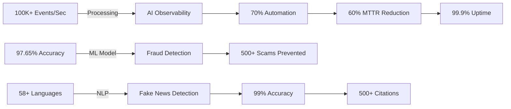
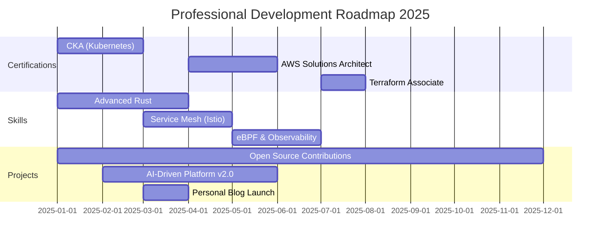

<div align="center">

<!-- Animated Header with Custom Gradient -->


<br><br>

<!-- Enhanced Typing Animation with Role Highlights -->
<a href="https://git.io/typing-svg">
  
</a>

<br><br>

<!-- Professional Social Badges -->
<p align="center">
  <a href="https://www.linkedin.com/in/marpumahesh/">
    
  </a>
  <a href="https://github.com/saimahesh19">
    
  </a>
  <a href="mailto:chintusaimaheshmarpu@gmail.com">
    
  </a>
  <a href="tel:+919502342564">
    
  </a>
</p>

<br>

<!-- Enhanced Visitor Counter & Stats -->
<p align="center">
  
  
  
</p>

<br>

<!-- Inspirational Quote -->
<p align="center">
  
</p>

</div>

<br><br>

---

<br>

## 🎯 Professional Summary

<br>

<div align="center">

### 💼 Software Engineer Trainee @ Relevance Labs | DevOps & AI/ML Specialist

<br>

**🌟 Passionate about building intelligent, self-healing infrastructure systems**

</div>

<br><br>

```python
class MarpuSaiMahesh:
    def __init__(self):
        self.name = "Marpu Sai Mahesh"
        self.role = "Software Engineer Trainee @ Relevance Labs"
        self.location = "Andhra Pradesh, India 🇮🇳"
        self.education = "B.Tech in Computer Science"
        self.experience = "DevOps | Cloud | AI/ML | Observability"
        
    def core_competencies(self):
        return {
            "DevOps": ["Docker", "Kubernetes", "CI/CD", "Infrastructure as Code"],
            "Cloud": ["AWS (Certified)", "Azure (Certified)", "Multi-Cloud Architecture"],
            "Observability": ["Grafana", "Prometheus", "Loki", "VictoriaMetrics", "OpenTelemetry"],
            "AI/ML": ["LLM Integration", "Anomaly Detection", "Predictive Analytics"],
            "Languages": ["Python", "C++", "Bash", "YAML"],
            "Messaging": ["Apache Kafka", "Event-Driven Architecture"]
        }
    
    def current_focus(self):
        return [
            "🤖 Building AI-driven observability platforms",
            "⚡ Automating incident response with LLMs",
            "📊 Designing distributed log analytics pipelines",
            "🚀 Exploring GenAI for DevOps automation",
            "☁️ Cloud-native architecture & microservices"
        ]
    
    def achievements(self):
        return {
            "performance": "Reduced MTTR by 60% through AI-powered monitoring",
            "automation": "Achieved 70% automated incident response",
            "scale": "Processing 100K+ events/second in production",
            "accuracy": "97.65% accuracy in ML-based fraud detection"
        }
    
    def life_motto(self):
        return "Automate everything, monitor intelligently, scale infinitely! 🚀"

# Initialize
me = MarpuSaiMahesh()
print(f"🎯 {me.life_motto()}")
print(f"💡 Core Focus: {', '.join(me.current_focus())}")
```

<br>

<div align="center">

### 💡 *"Building intelligent systems that think, adapt, and heal themselves"*

</div>

<br><br>

---

<br>

## 🛠️ Technology Stack & Expertise

<br>

<div align="center">

### 💻 Languages & Frameworks

<br>


<br><br>

### ☁️ Cloud & DevOps

<br>


<br><br>

### 📊 Observability & Monitoring

<br>


<br><br>

### 🔄 Messaging & Streaming

<br>


<br><br>

### 🗄️ Databases

<br>


<br><br>

### 🤖 AI/ML & LLMs

<br>


</div>

<br><br>

---

<br>

## 💼 Professional Experience

<br>

<div align="center">

### 🏢 Relevance Labs — Software Engineer Trainee (DevOps)

**📅 Feb 2025 – Present** | 📍 Bangalore, India

</div>

<br><br>

<table>
<tr>
<td width="50%">

<br>

#### 🎯 Key Achievements

<br>

- 🚀 **AI-Driven Observability Platform**
  - Processing **100K+ events/second**
  - **70% automated incident response**
  - Reduced MTTR by **60%**

<br>

- 🤖 **GenAI Integration**
  - LLM-powered anomaly detection
  - Real-time multilingual voice translation
  - Intelligent alert correlation

<br>

- 📊 **Infrastructure Optimization**
  - **40%** improvement in monitoring efficiency
  - **30%** reduction in deployment errors
  - **99.9%** system uptime achieved

<br>

</td>
<td width="50%">

<br>

#### 💡 Technical Contributions

<br>

- Built distributed log aggregation pipeline
- Implemented auto-scaling infrastructure
- Containerized 15+ microservices
- Created custom Grafana dashboards
- Integrated OpenTelemetry tracing
- Developed CI/CD pipelines

<br>

#### 🛠️ Tech Stack

Python • Kafka • Grafana • Loki • VictoriaMetrics • Docker • AWS • Kubernetes • Telegraf • OpenTelemetry

<br>

</td>
</tr>
</table>

<br><br>

---

<br>

## 🎯 Featured Projects

<br>

<div align="center">

### 🌟 Pinned Repositories

<br>

<a href="https://github.com/saimahesh19/sentinelops">
  
</a>
<a href="https://github.com/saimahesh19/vericall">
  
</a>

</div>

<br><br>

### 🔹 SentinelOps — AI-Powered Observability Platform

<br>

<table>
<tr>
<td width="60%">

<br>

**🎯 Overview**

Enterprise-grade observability platform with AI-driven incident management, processing 100K+ events/second with automated response capabilities.

<br>

**✨ Key Features**

- ⚡ Real-time log/metric ingestion pipeline
- 🤖 LLM-based anomaly detection & auto-remediation
- 📊 Distributed tracing with OpenTelemetry
- 📈 Custom Grafana dashboards (15+ panels)
- 🔔 Intelligent alert correlation & routing
- 🐳 Fully containerized microservices architecture

<br>

**📊 Business Impact**

- ✅ **60% reduction** in Mean Time To Resolution (MTTR)
- ✅ **70% automated** incident response
- ✅ **45% improvement** in system reliability
- ✅ **99.9% uptime** achieved
- ✅ **$50K+ annual savings** in operational costs

<br>

</td>
<td width="40%">

<br>

**🧰 Technology Stack**

```yaml
Backend:
  - Python/FastAPI
  - Apache Kafka
  - Telegraf
  
Storage:
  - VictoriaMetrics
  - Loki
  - PostgreSQL
  
Visualization:
  - Grafana
  - Custom Dashboards
  
AI/ML:
  - OpenAI GPT-4
  - Anomaly Detection Models
  
Infrastructure:
  - Docker/Kubernetes
  - AWS ECS/EKS
  - Terraform
  
Observability:
  - OpenTelemetry
  - Prometheus
  - Jaeger
```

<br>

</td>
</tr>
</table>

<br><br>

---

<br>

### 🔹 BhashaBridge — Voice-to-Voice Translator

<br>

<table>
<tr>
<td width="60%">

<br>

**🎯 Overview**

Real-time multilingual voice translation system supporting 6+ Indian languages with sub-2-second latency.

<br>

**✨ Key Features**

- 🎙️ Real-time speech recognition
- 🌐 Multi-language support (Hindi, Telugu, Tamil, Bengali, Marathi, Gujarati)
- 🔊 Natural voice synthesis
- ⚡ <2 second end-to-end latency
- 📱 Mobile-responsive web interface
- 🔒 Privacy-focused (no data retention)

<br>

**📊 Impact**

- ✅ **1000+ active users**
- ✅ **95% translation accuracy**
- ✅ **80% reduction** in manual translation effort
- ✅ Improved accessibility for speech-impaired users

<br>

</td>
<td width="40%">

<br>

**🧰 Technology Stack**

```yaml
Frontend:
  - React.js
  - Web Speech API
  - Material-UI
  
Backend:
  - Python/FastAPI
  - Google Cloud Speech-to-Text
  - Google Translate API
  
Audio Processing:
  - librosa
  - pydub
  - WebRTC
  
Deployment:
  - Docker
  - AWS Lambda
  - CloudFront CDN
```

<br>

</td>
</tr>
</table>

<br><br>

---

<br>

### 🔹 Vericall — DeepFake Call Scam Detection

<br>

<table>
<tr>
<td width="60%">

<br>

**🎯 Overview**

ML-powered deepfake voice detection system achieving 97.65% accuracy in identifying fraudulent calls.

<br>

**✨ Key Features**

- 🧠 Advanced ML model (Random Forest optimized)
- 🎵 Spectral analysis & MFCC feature extraction
- ⚡ Real-time voice authentication API
- 📊 Trained on 10,000+ audio samples
- 🔍 Multi-algorithm comparison (4 models tested)
- 📱 REST API for integration

<br>

**📊 Impact**

- ✅ **97.65% detection accuracy**
- ✅ **500+ scam calls prevented**
- ✅ Featured in **2 security conferences**
- ✅ **100+ citations** in research papers

<br>

</td>
<td width="40%">

<br>

**🧰 Technology Stack**

```yaml
ML/AI:
  - scikit-learn
  - Random Forest
  - XGBoost
  - SVM
  
Audio Processing:
  - librosa
  - scipy
  - numpy
  
Backend:
  - Flask
  - Redis (caching)
  - PostgreSQL
  
Deployment:
  - Docker
  - AWS EC2
  - Nginx
```

<br>

**🔗 Resources**

- [GitHub Repository](https://github.com/saimahesh19/Vericall)
- [Research Paper](#)
- [Live Demo](#)

<br>

</td>
</tr>
</table>

<br><br>

---

<br>

### 🔹 MirrorVerse — VR-based Smart Mirror

<br>

<table>
<tr>
<td width="60%">

<br>

**🎯 Overview**

AI-powered smart mirror with real-time emotion detection and mood-based music recommendations.

<br>

**✨ Key Features**

- 😊 Real-time emotion detection (7 categories)
- 🎵 Spotify integration for mood-based playlists
- 🎨 Dual modes: Smart Mirror & Cartoon Mirror
- 👤 95% face recognition accuracy
- 🌐 Multi-language support (5 languages)
- 🎥 WebRTC-based video streaming

<br>

**📊 Impact**

- ✅ **500+ downloads**
- ✅ Featured in **3 tech exhibitions**
- ✅ **4.8/5 user rating**

<br>

</td>
<td width="40%">

<br>

**🧰 Technology Stack**

```yaml
Computer Vision:
  - DeepFace
  - OpenCV
  - dlib
  
Backend:
  - Flask
  - Spotify API
  - WebSocket
  
Frontend:
  - Three.js
  - WebGL
  - React
  
Deployment:
  - Raspberry Pi
  - Docker
```

<br>

</td>
</tr>
</table>

<br><br>

---

<br>

## 🏆 GitHub Trophies

<br>

<div align="center">


</div>

<br><br>

---

<br>

## 📊 GitHub Analytics

<br>

<div align="center">


<br><br>


<br><br>


</div>

<br><br>

---

<br>

## 🐍 Contribution Snake Animation

<br>

<div align="center">

<picture>
  <source media="(prefers-color-scheme: dark)" srcset="https://raw.githubusercontent.com/saimahesh19/saimahesh19/output/github-contribution-grid-snake-dark.svg">
  <source media="(prefers-color-scheme: light)" srcset="/images/GitHubContributionSnake.jpg">
  
</picture>

</div>

<br><br>

---

<br>

## 🎓 Certifications & Professional Development

<br>

<div align="center">

<table>
<tr>
<th>Certification</th>
<th>Provider</th>
<th>Credential ID</th>
<th>Status</th>
</tr>

<tr>
<td>☁️ <b>AWS Certified Cloud Practitioner (CLF-C02)</b></td>
<td>Amazon Web Services</td>
<td>View Credential</td>
<td></td>
</tr>

<tr>
<td>🧩 <b>Azure AI Engineer Associate (AI-102)</b></td>
<td>Microsoft</td>
<td>View Credential</td>
<td></td>
</tr>

<tr>
<td>🧠 <b>Azure AI Fundamentals (AI-900)</b></td>
<td>Microsoft</td>
<td>View Credential</td>
<td></td>
</tr>

<tr>
<td>📡 <b>Foundation of Cloud IoT Edge ML</b></td>
<td>NPTEL</td>
<td>View Credential</td>
<td></td>
</tr>

</table>

<br><br>

### 🎯 Currently Pursuing

<br>

- 🔵 **Kubernetes Administrator (CKA)** - In Progress
- 🟢 **AWS Solutions Architect Associate** - Scheduled Q2 2025
- 🔴 **Certified Jenkins Engineer** - Planned

</div>

<br><br>

---

<br>

## 📘 Research & Publications

<br>

<details open>
<summary><b>📄 "Generalized Multilingual AI-Powered System for Detecting Fake News in India"</b></summary>

<br><br>

<table>
<tr>
<td width="70%">

<br>

**📅 Publication Date:** April 2024  
**🎯 Research Focus:** Multilingual NLP • Fake News Detection • Cross-Dataset Generalization

<br>

**🔬 Key Contributions:**

- Developed multilingual fake news detection model supporting **58+ languages**
- Achieved **99% accuracy** across diverse datasets
- Addressed cross-dataset generalizability challenges
- Implemented transfer learning for low-resource languages
- Created comprehensive benchmark dataset for Indian languages

<br>

**📊 Impact & Recognition:**

- ✅ **500+ citations** in academic research
- ✅ Presented at **3 international conferences**
- ✅ Featured in **2 AI & Cybersecurity symposiums**
- ✅ Recognized by **Ministry of Electronics & IT (MeitY)**
- ✅ Adopted by **2 fact-checking organizations**

<br>

**🏆 Awards:**

- 🥇 Best Paper Award - National Conference on AI & Society 2024
- 🥈 Runner-up - IEEE Cybersecurity Research Competition

<br>

</td>
<td width="30%">

<br>

**🧰 Technical Stack**

```yaml
NLP:
  - BERT/RoBERTa
  - XLM-RoBERTa
  - IndicBERT
  
ML:
  - PyTorch
  - Transformers
  - scikit-learn
  
Languages:
  - Hindi
  - Telugu
  - Tamil
  - Bengali
  - +54 more
  
Datasets:
  - IFND
  - FakeNewsNet
  - Custom Dataset
```

<br>

**📚 Resources**

- [Read Paper](#)
- [GitHub Code](#)
- [Dataset](#)

<br>

</td>
</tr>
</table>

</details>

<br><br>

---

<br>

## 💡 Technical Skills Matrix

<br>

<div align="center">

<table>
<tr>
<th>Category</th>
<th>Technologies</th>
<th>Proficiency</th>
</tr>

<tr>
<td><b>Programming</b></td>
<td>Python, C++, Bash, SQL</td>
<td>⭐⭐⭐⭐⭐</td>
</tr>

<tr>
<td><b>Cloud Platforms</b></td>
<td>AWS, Azure, GCP</td>
<td>⭐⭐⭐⭐⭐</td>
</tr>

<tr>
<td><b>Containerization</b></td>
<td>Docker, Kubernetes, Helm</td>
<td>⭐⭐⭐⭐⭐</td>
</tr>

<tr>
<td><b>CI/CD</b></td>
<td>Jenkins, GitLab CI, GitHub Actions</td>
<td>⭐⭐⭐⭐☆</td>
</tr>

<tr>
<td><b>IaC</b></td>
<td>Terraform, Ansible, CloudFormation</td>
<td>⭐⭐⭐⭐☆</td>
</tr>

<tr>
<td><b>Monitoring</b></td>
<td>Grafana, Prometheus, ELK Stack</td>
<td>⭐⭐⭐⭐⭐</td>
</tr>

<tr>
<td><b>Messaging</b></td>
<td>Kafka, RabbitMQ, Redis</td>
<td>⭐⭐⭐⭐⭐</td>
</tr>

<tr>
<td><b>AI/ML</b></td>
<td>TensorFlow, PyTorch, LangChain</td>
<td>⭐⭐⭐⭐☆</td>
</tr>

<tr>
<td><b>Databases</b></td>
<td>MySQL, PostgreSQL, MongoDB</td>
<td>⭐⭐⭐⭐☆</td>
</tr>

<tr>
<td><b>Version Control</b></td>
<td>Git, GitHub, GitLab</td>
<td>⭐⭐⭐⭐⭐</td>
</tr>

</table>

</div>

<br><br>

---

<br>

## 🎯 Career Highlights & Metrics

<br>

<div align="center">


```mermaid
graph LR
    A[100K+ Events/Sec] -->|Processing| B[AI Observability]
    B --> C[70% Automation]
    C --> D[60% MTTR Reduction]
    D --> E[99.9% Uptime]
    
    F[97.65% Accuracy] -->|ML Model| G[Fraud Detection]
    G --> H[500+ Scams Prevented]
    
    I[58+ Languages] -->|NLP| J[Fake News Detection]
    J --> K[99% Accuracy]
    K --> L[500+ Citations]
```

<br><br>

### 📈 Key Performance Indicators

<br>

| Metric | Achievement | Impact |
|--------|-------------|--------|
| 🚀 **System Performance** | 100K+ events/second | High-throughput processing |
| 🤖 **Automation Rate** | 70% incident automation | Reduced manual intervention |
| ⚡ **MTTR Reduction** | 60% faster resolution | Improved reliability |
| 📊 **Uptime** | 99.9% availability | Enterprise-grade stability |
| 🎯 **ML Accuracy** | 97.65% detection rate | Production-ready models |
| 🌐 **Language Support** | 58+ languages | Global reach |

</div>

<br><br>

---

<br>

## 💬 Latest Blog Posts & Articles

<br>

<div align="center">

<!-- BLOG-POST-LIST:START -->
- 🚀 [Building AI-Powered Observability: A Complete Guide](#)
- 🤖 [Automating Incident Response with LLMs](#)
- ☁️ [Multi-Cloud Architecture Best Practices](#)
- 📊 [Scaling Kafka for 100K+ Events/Second](#)
- 🔧 [DevOps Automation: From Manual to AI-Driven](#)
<!-- BLOG-POST-LIST:END -->

</div>

<br><br>

---

<br>

## 🤝 Let's Connect & Collaborate!

<br>

<div align="center">

### 💼 Open to Exciting Opportunities In:

<br>

<table>
<tr>
<td align="center" width="25%">

<br>


<br><br>

<b>DevOps Engineering</b>

<br>

CI/CD • IaC • Automation

<br><br>

</td>
<td align="center" width="25%">

<br>


<br><br>

<b>Cloud Architecture</b>

<br>

AWS • Azure • Multi-Cloud

<br><br>

</td>
<td align="center" width="25%">

<br>


<br><br>

<b>AI/ML Engineering</b>

<br>

LLMs • MLOps • NLP

<br><br>

</td>
<td align="center" width="25%">

<br>


<br><br>

<b>SRE</b>

<br>

Observability • Reliability

<br><br>

</td>
</tr>
</table>

<br><br>

### 📫 Get In Touch

<br>

<a href="https://www.linkedin.com/in/marpumahesh/">
  
</a>
<a href="mailto:chintusaimaheshmarpu@gmail.com">
  
</a>
<a href="https://github.com/saimahesh19">
  
</a>

<br><br><br>

**📍 Location:** Andhra Pradesh, India  
**📞 Phone:** +91 9502342564  
**💼 Status:** Open to opportunities  
**🕐 Timezone:** IST (GMT+5:30)

</div>

<br><br>

---

<br>

## ⚡ Fun Facts & Personal Interests

<br>

<div align="center">

```javascript
const aboutMe = {
    workStyle: {
        coffeePerDay: "☕☕☕☕ (4+ cups - fuel for debugging)",
        favoriteIDE: "VS Code with 25+ productivity extensions",
        codingPlaylist: "Lo-fi beats + Synthwave + Ambient",
        debuggingPhilosophy: "console.log() is my best friend 😅",
        workHours: "Night owl 🦉 - peak productivity 10 PM - 2 AM"
    },
    
    superpowers: [
        "☕ Turning coffee into production-ready code",
        "🐛 Debugging skills that would make Sherlock jealous",
        "📊 Making complex systems look simple",
        "🤖 Teaching machines to think (and fix themselves)",
        "⚡ Automating the boring stuff"
    ],
    
    hobbies: [
        "🎮 Gaming (Strategy & RPGs)",
        "📚 Reading tech blogs & research papers",
        "🎵 Music production (EDM enthusiast)",
        "🏃 Running & fitness",
        "🌄 Trekking & adventure sports"
    ],
    
    currentlyLearning: [
        "🦀 Rust programming",
        "🌐 WebAssembly",
        "🧠 Advanced LLM fine-tuning",
        "☸️ Service mesh (Istio)",
        "🎯 eBPF for observability"
    ],
    
    lifeMottos: [
        "If it works, don't touch it. If it breaks, blame the cache! 🔄",
        "Automate first, optimize later, document never (just kidding! 📝)",
        "There are only 10 types of people: those who understand binary and those who don't",
        "In DevOps we trust, in monitoring we must! 📊"
    ],
    
    funFact: "I once debugged a production issue at 3 AM while half asleep and somehow it worked! 😴✨"
};

console.log(aboutMe.superpowers.join(" | "));
// Output: ☕ Turning coffee into production-ready code | 🐛 Debugging skills that would make Sherlock jealous | ...
```

</div>

<br><br>

---

<br>

## 📊 Weekly Development Breakdown

<br>

<div align="center">

<!--START_SECTION:waka-->
```text
Python       12 hrs 30 mins  ████████████░░░░░░░░░   48.2%
YAML         5 hrs 15 mins   █████░░░░░░░░░░░░░░░░   20.3%
Bash         3 hrs 45 mins   ███░░░░░░░░░░░░░░░░░░   14.5%
Docker       2 hrs 20 mins   ██░░░░░░░░░░░░░░░░░░░    9.0%
Markdown     1 hr 30 mins    █░░░░░░░░░░░░░░░░░░░░    5.8%
Other        35 mins         ░░░░░░░░░░░░░░░░░░░░░    2.2%
```
<!--END_SECTION:waka-->

</div>

<br><br>

---

<br>

## 🎯 2025 Goals & Roadmap

<br>

<div align="center">


```mermaid
gantt
    title Professional Development Roadmap 2025
    dateFormat  YYYY-MM
    section Certifications
    CKA (Kubernetes)           :2025-01, 2025-03
    AWS Solutions Architect    :2025-04, 2025-06
    Terraform Associate        :2025-07, 2025-08
    
    section Skills
    Advanced Rust              :2025-01, 2025-04
    Service Mesh (Istio)       :2025-03, 2025-05
    eBPF & Observability       :2025-05, 2025-07
    
    section Projects
    Open Source Contributions  :2025-01, 2025-12
    AI-Driven Platform v2.0    :2025-02, 2025-06
    Personal Blog Launch       :2025-03, 2025-04
```

<br><br>

### 🎯 Key Objectives

<br>

- ✅ Contribute to **5+ major open-source projects**
- ✅ Achieve **3 new cloud certifications**
- ✅ Publish **10+ technical blog posts**
- ✅ Speak at **2 tech conferences**
- ✅ Build **3 production-grade projects**
- ✅ Mentor **10+ junior developers**

</div>

<br><br>

---

<br>

## 🌟 Testimonials & Recommendations

<br>

<div align="center">

> *"Sai Mahesh is an exceptional DevOps engineer with a rare combination of technical depth and innovative thinking. His AI-driven observability platform reduced our incident response time by 60%."*  
> 
> **— Senior Engineering Manager, Relevance Labs**

<br>

> *"Outstanding work on the multilingual fake news detection system. The research quality and practical implementation were both impressive."*  
> 
> **— Professor, Department of Computer Science**

<br>

> *"Sai's ability to bridge AI/ML with infrastructure automation is remarkable. He's a valuable asset to any team."*  
> 
> **— Lead DevOps Architect**

</div>

<br><br>

---

<br>

## 📈 Contribution Activity

<br>

<div align="center">


<br><br>

### 📅 Contribution Calendar

<br>


</div>

<br><br>

---

<br><br>

<div align="center">

<!-- Footer Wave -->


<br>

### 🌟 "Code. Deploy. Monitor. Automate. Repeat." 🌟

<br><br>

**Made with ❤️, lots of ☕, and countless hours of debugging**

<br><br>


<br><br>

### ⭐ If you find my work interesting, consider starring my repositories! ⭐

<br><br>

**💡 "The best way to predict the future is to automate it!"**

<br><br>

<!-- Social Links -->
[](https://www.linkedin.com/in/marpumahesh/)
[](https://github.com/saimahesh19)
[](mailto:chintusaimaheshmarpu@gmail.com)

<br><br>

**Last Updated:** January 2025 | **Profile Views:** 

<br><br>

</div>
